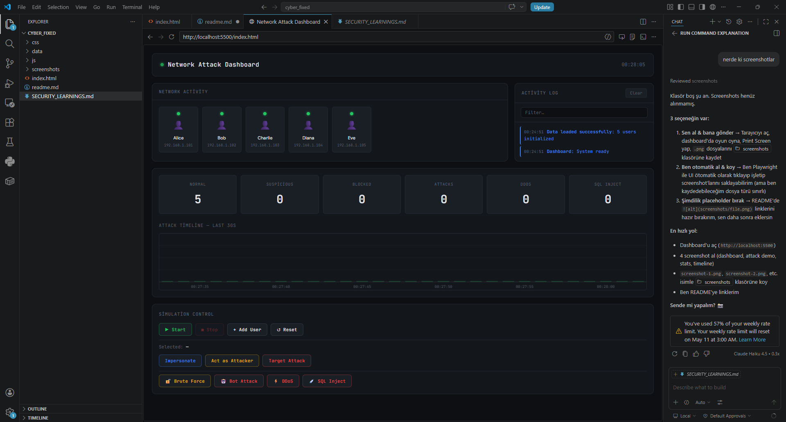
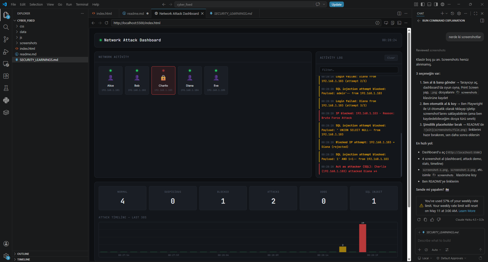

# Network Security Simulation Dashboard

**Project by:** Enes Anılır | Software Engineering Student  
**GitHub:** https://github.com/eanilir | **Live Demo:** http://localhost:5500/index.html

---

## Project Overview

A browser-based **interactive security simulation dashboard** that visualizes user activity, suspicious behavior, and simulated cyberattacks in real time. The dashboard models realistic defense mechanisms including rate limiting, IP blocking, and behavioral anomaly detection.

**Key Use Case:** Demonstrates understanding of common attack patterns (brute-force, bot networks, DDoS, SQL injection) and how modern security systems detect and respond to threats.

---

## Features

✅ **Real-time Attack Simulation**
- Execute multiple attack types: Brute Force, Bot Network, DDoS, SQL Injection
- Observable attack impact on network security stats in real time

✅ **Network Visualization**
- Interactive user grid showing live status (Normal, Suspicious, Blocked, Under Attack)
- Click-based attacker/target selection for intuitive attack workflow

✅ **Security Detection & Response**
- IP-based rate limiting and source blocking
- Suspicious activity pattern recognition
- Distributed bot network detection via multi-IP targeting
- Attack timeline visualization (30-second rolling chart)

✅ **Comprehensive Event Logging**
- Real-time event stream with log filtering
- Color-coded severity levels (Success, Warning, Error, Info)
- Pause/resume auto-scroll for detailed analysis

✅ **Security Statistics Dashboard**
- Live counters: Normal Users | Suspicious Activity | Blocked IPs | Total Attacks
- Separate tracking for DDoS and SQL injection attempts
- Automatic stat updates during simulations

✅ **Realistic Attack Workflow**
- Multi-step selection: Select Attacker → Select Target → Choose Attack Type → Execute
- Clear validation prevents accidental or incomplete attacks
- Displays attack metadata (source IP, target, attempt count) before execution

---

## Technologies Used

| Category | Technologies |
|----------|---------------|
| **Frontend** | HTML5, CSS3 (with CSS Variables), Vanilla JavaScript (ES6+ Classes) |
| **Browser APIs** | `fetch()` API, DOM Manipulation, Canvas (Charts), localStorage |
| **Data Format** | JSON |
| **Styling** | Responsive CSS Grid & Flexbox, Dark theme design |
| **Dev Server** | Python `http.server` (port 5500) |
| **Icons** | Font Awesome |

---

## Screenshots

### Dashboard Initial State


### Attack Simulation in Progress


### Activity Logs & Security Events


---

## Installation

### Prerequisites
- Python 3.x (for local development server)
- Modern web browser (Chrome, Firefox, Safari, Edge)

### Setup Instructions

1. **Clone or download the project:**
   ```bash
   cd /path/to/cyber_fixed
   ```

2. **Start a local HTTP server:**
   ```bash
   # On Windows (PowerShell/Command Prompt):
   python -m http.server 5500
   # Or: py -m http.server 5500

   # On macOS/Linux:
   python3 -m http.server 5500
   ```

3. **Open in browser:**
   ```
   http://localhost:5500/index.html
   ```

4. **Verify data loads:**
   - Check the network grid populates with users
   - Verify stats appear in the dashboard
   - Try a simulation to confirm event logging works

### Project Structure
```
cyber_fixed/
├── index.html                 # Main dashboard UI
├── css/
│   └── style.css             # Responsive styling & dark theme
├── js/
│   ├── simulation.js          # Attack simulation engine & detection logic
│   ├── ui.js                  # Dashboard rendering & event handlers
│   └── logger.js              # Centralized log management
├── data/
│   └── users.json             # Seed user data & attack IP lists
└── README.md                  # This file
```

---

## Future Improvements

🔄 **Short-term Enhancements:**
- Add export/download functionality for attack logs and statistics
- Implement user-defined attack parameters (attempt count, time intervals)
- Add filtering by attack type in the log panel
- Responsive mobile dashboard layout improvements

🚀 **Medium-term Features:**
- Backend API integration for persistent log storage
- Multi-session attack coordination scenarios
- Attack difficulty levels (easy/medium/hard simulation parameters)
- Network topology visualization with node connections
- Live threat feed from public security APIs

💾 **Long-term Vision:**
- Real-time data persistence (database integration)
- Role-based dashboard (Admin / Analyst / Executive views)
- Automated attack replay functionality
- Machine learning-based anomaly scoring
- Compliance reporting (GDPR, SOC 2 audit trails)

---

## What I Learned

### 🎯 Key Technical Learnings

**1. Browser Security Constraints**
- Local file access (`file://` protocol) blocks `fetch()` API calls for security reasons
- Solution: HTTP server (even local) required for JSON data loading; applies to any client-side app

**2. Effective Log Management**
- Unchecked event logging causes exponential noise (18 events from 1 action)
- Strategic filtering (conditional tracking flags) is better than suppression
- Implemented `trackSuspicious` and `trackTarget` options for realistic simulation control

**3. Realistic Defense Simulation**
- Attackers and defenders follow different rules:
  - **Attacker:** IP gets blocked (persistent)
  - **Victim:** Status = "under attack" (temporary, not permanent lockout)
- Layered defense (IP blocking ≠ account lockout) required for authentic modeling

**4. User Experience in Security Tools**
- Multi-step workflows need clear visual feedback:
  - State 1: Select attacker (highlight color change)
  - State 2: Select target (second highlight)
  - State 3: Choose attack type (button differentiation)
  - State 4: Execute with confirmation
- Prevents accidental execution and improves analyst understanding

**5. Canvas-based Data Visualization**
- Real-time charts require efficient rendering (avoid redraw flicker)
- Used 30-bar rolling window for 30-second attack timeline
- Performance: smooth animation at 60fps with DOM + Canvas combination

**6. JSON-driven Simulation Architecture**
- Data-driven design enables quick scenario changes
- Seed data (`users.json`) allows multiple test runs without code changes
- Extensible: New user profiles or attack IPs added by editing JSON only

### 🎨 Soft Skills & Project Management

- **Code organization:** Separated concerns (simulation engine vs. UI rendering vs. logging)
- **Iterative refinement:** Started with basic logging, evolved to strategic filtering
- **Stakeholder communication:** Documented attack flows and design decisions for reviewers
- **Problem-solving:** Debugged CORS/fetch issues, then optimized UX workflow based on feedback

---

## Related Documentation

- **[Security Learnings Deep Dive](SECURITY_LEARNINGS.md)** — Technical security concepts & defense mechanisms  

---

## Contact & Social

- **Email:** [enesanilir1@gmail.com]
- **GitHub:** https://github.com/eanilir
- **LinkedIn:** [www.linkedin.com/in/enesanilir]

---

## License

This project is provided as-is for educational and portfolio purposes.

---

**Last Updated:** May 2026
